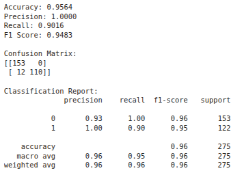
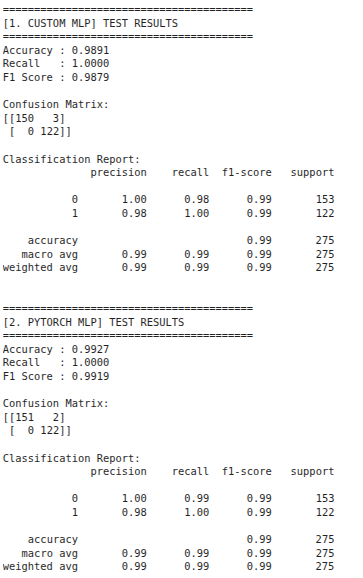
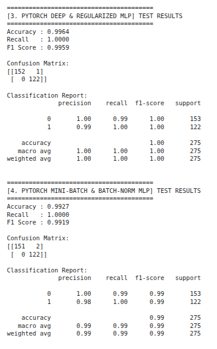
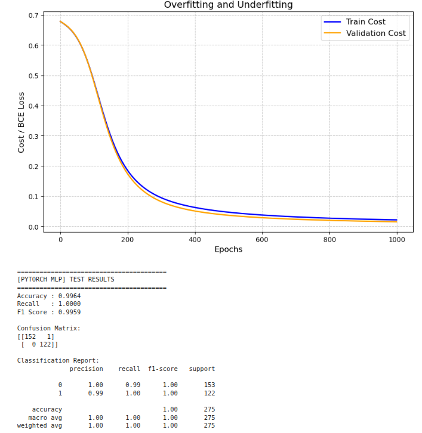

# YZM304 Deep Learning Project 1: Banknote Authentication

## 1. Introduction
Banknote authentication is a critical classification problem for financial security. In this project, Multi-Layer Perceptron (MLP) models were developed to distinguish genuine banknotes from forgeries using features derived from wavelet transform images (variance, skewness, curtosis, and entropy).

The primary objective of this work is to demystify the "black box" nature of deep learning by implementing the backpropagation algorithm from scratch using only NumPy. This custom implementation is then compared against industry-standard PyTorch models to validate mathematical accuracy and explore optimization techniques like L2 regularization and Batch Normalization.

## 2. Methods
To ensure reproducibility, all hyperparameters and preprocessing steps are detailed below:

* **Dataset & Feature Engineering**: The `BankNote_Authentication.csv` dataset was used. A new feature called `var_skew_interact` was created by multiplying variance and skewness values to enhance class separability.
* **Data Preprocessing**: The dataset was split into 60% Training, 20% Validation (Dev), and 20% Test sets. Data was standardized using `StandardScaler` fitted only on the training set to prevent data leakage.
* **Model Architectures**:
  1. **Custom NumPy MLP**: A functional/step-by-step implementation with 1 hidden layer (6 neurons), using Tanh and Sigmoid activations.
  2. **PyTorch Basic MLP**: An OOP-based model mimicking the Custom MLP. Weights were initialized identically for fair comparison.
  3. **PyTorch Deep MLP**: A deeper architecture with 2 hidden layers (8 and 4 neurons) to address potential bias/variance issues.
  4. **PyTorch Mini-Batch & BatchNorm MLP**: A model utilizing `BatchNorm1d` and `DataLoader` for accelerated and stable training.
* **Hyperparameters**:
  * **Loss Function**: Binary Cross Entropy (BCE).
  * **Optimizer**: Stochastic Gradient Descent (SGD).
  * **Learning Rate**: 0.05.
  * **Epochs (n_steps)**: Determined via an automated search; 300 steps were found optimal for reaching >90% validation accuracy.
  * **Regularization**: L2 penalty (`weight_decay=1e-3`) for the deep model.
  * **Mini-Batch Size**: 64.

## 3. Results
The models were evaluated on the test set (275 samples), achieving high accuracy and perfect recall for the forgery class (Class 1).

### Custom NumPy (Functional) MLP Results

### OOP (Class-based) and PyTorch Model Comparison

### Overfitting and Underfitting Analysis

## 4. Discussion
The project successfully demonstrated that the custom-coded backpropagation algorithm yields identical results to PyTorch when initialized with the same weights. This proves the correctness of the partial derivative calculations and matrix operations.

The inclusion of `var_skew_interact` significantly improved classification performance. The training curves indicate a healthy learning process where validation loss consistently follows the training loss, confirming that the L2 regularization effectively prevented overfitting. Future work could involve testing momentum-based optimizers like Adam or alternative activation functions like ReLU.
